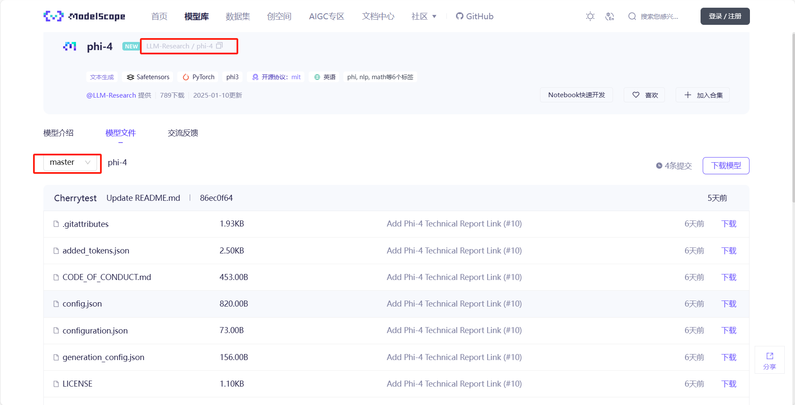
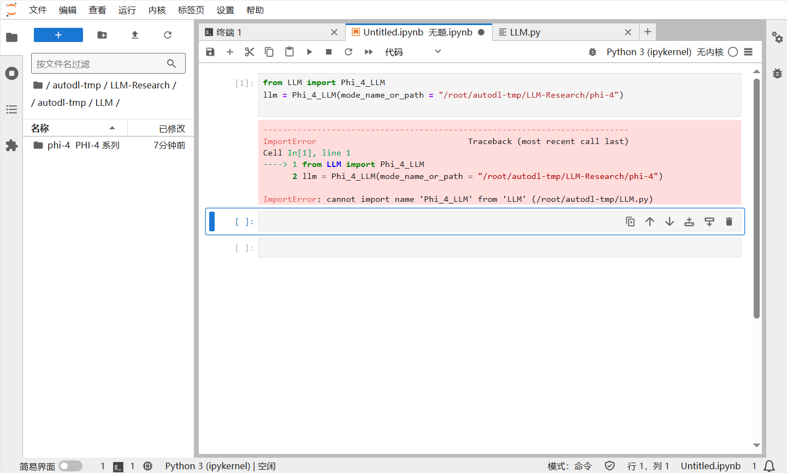
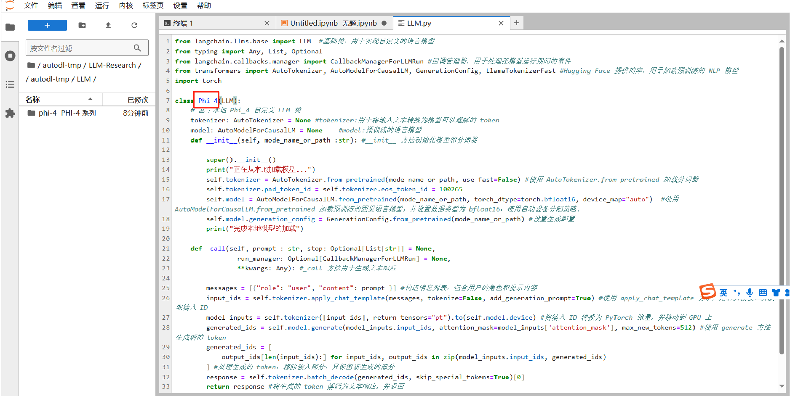

# Phi-4 Langchain接入

## 环境准备

本文基础环境如下：

```
----------------
ubuntu 22.04
python 3.12
cuda 12.1
pytorch 2.3.0
----------------
```

> 本文默认学习者已安装好以上 Pytorch(cuda) 环境，如未安装请自行安装。

pip 换源加速下载并安装依赖包

```bash
# 升级pip
python -m pip install --upgrade pip
# 更换 pypi 源加速库的安装
pip config set global.index-url https://pypi.tuna.tsinghua.edu.cn/simple

pip install transformers==4.44.2
pip install huggingface-hub==0.25.0
pip install accelerate==0.34.2
pip install modelscope==1.18.0
pip install langchain==0.3.0
```

>考虑到部分同学配置环境可能会遇到一些问题，我们在AutoDL平台准备了Phi-4的环境镜像，点击下方链接并直接创建Autodl示例即可。 ***https://www.codewithgpu.com/i/datawhalechina/self-llm/self-llm-phi4***

## 模型下载

使用魔搭社区中的 `modelscope` 中的 `snapshot_download` 函数下载模型，第一个参数为模型名称（如何找到该名称？可以在魔搭社区搜该模型，如下图中所框），参数 `cache_dir` 为模型的下载路径，参数`revision`一般默认为`master`。

在`/root/autodl-tmp` 新建 `model_download.py` 文件并在其中输入以下内容，粘贴代码后记得保存文件，如下所示。并运行 `python model_download.py` 执行下载，模型大小为 28 GB左右，下载模型大概需要10到 20 分钟。

```python
import torch
from modelscope import snapshot_download, AutoModel, AutoTokenizer
import os
model_dir = snapshot_download('LLM-Research/phi-4', cache_dir='/root/autodl-tmp', revision='master')
```

> 注意：记得修改 `cache_dir` 为你的模型下载路径哦~



## 代码准备

为便捷构建 `LLM` 应用，我们需要基于本地部署的 `Phi_4_LLM`，自定义一个 `LLM` 类，（这个类主要用于加载和调用一个基于本地的预训练语言模型,如Phi_4，并根据1给定的提示生成文本响应）将 `Phi_4` 接入到 `LangChain` 框架中。完成自定义 `LLM` 类之后，可以以完全一致的方式调用 `LangChain` 的接口，而无需考虑底层模型调用的不一致。

基于本地部署的 `Phi_4` 自定义 `LLM` 类并不复杂，我们只需从 `LangChain.llms.base.LLM` 类继承一个子类，并重写构造函数与 `_call` 函数即可：

在当前路径新建一个 `LLM.py` 文件，并输入以下内容，粘贴代码后记得保存文件。

```python
from langchain.llms.base import LLM  #基础类，用于实现自定义的语言模型
from typing import Any, List, Optional
from langchain.callbacks.manager import CallbackManagerForLLMRun #回调管理器，用于处理在模型运行期间的事件
from transformers import AutoTokenizer, AutoModelForCausalLM, GenerationConfig, LlamaTokenizerFast #Hugging Face 提供的库，用于加载预训练的 NLP 模型
import torch

class Phi_4_LLM(LLM):
    # 基于本地 Phi_4 自定义 LLM 类
    tokenizer: AutoTokenizer = None #tokenizer:用于将输入文本转换为模型可以理解的 token
    model: AutoModelForCausalLM = None    #model:预训练的语言模型    
    def __init__(self, mode_name_or_path :str): #__init__ 方法初始化模型和分词器

        super().__init__()
        print("正在从本地加载模型...")
        self.tokenizer = AutoTokenizer.from_pretrained(mode_name_or_path, use_fast=False) #使用 AutoTokenizer.from_pretrained 加载分词器
        self.tokenizer.pad_token_id = self.tokenizer.eos_token_id = 100265
        self.model = AutoModelForCausalLM.from_pretrained(mode_name_or_path, torch_dtype=torch.bfloat16, device_map="auto")  #使用 AutoModelForCausalLM.from_pretrained 加载预训练的因果语言模型，并设置数据类型为 bfloat16，使用自动设备分配策略。
        self.model.generation_config = GenerationConfig.from_pretrained(mode_name_or_path) #设置生成配置
        print("完成本地模型的加载")
        
    def _call(self, prompt : str, stop: Optional[List[str]] = None,
                run_manager: Optional[CallbackManagerForLLMRun] = None,
                **kwargs: Any): #_call 方法用于生成文本响应

        messages = [{"role": "user", "content": prompt }] #构造消息列表，包含用户的角色和提示内容
        input_ids = self.tokenizer.apply_chat_template(messages, tokenize=False, add_generation_prompt=True) #使用 apply_chat_template 方法应用聊天模板，并获取输入 ID
        model_inputs = self.tokenizer([input_ids], return_tensors="pt").to(self.model.device) #将输入 ID 转换为 PyTorch 张量，并移动到 GPU 上
        generated_ids = self.model.generate(model_inputs.input_ids, attention_mask=model_inputs['attention_mask'], max_new_tokens=512) #使用 generate 方法生成新的 token
        generated_ids = [
            output_ids[len(input_ids):] for input_ids, output_ids in zip(model_inputs.input_ids, generated_ids)
        ] #处理生成的 token，移除输入部分，只保留新生成的部分
        response = self.tokenizer.batch_decode(generated_ids, skip_special_tokens=True)[0]       
        return response #将生成的 token 解码为文本响应，并返回
    @property
    def _llm_type(self) -> str:
        return "Phi_4"
```

在上述类定义中，我们分别重写了构造函数和 `_call` 函数：对于构造函数，我们在对象实例化的一开始加载本地部署的 `Phi_4` `模型，从而避免每一次调用都需要重新加载模型带来的时间过长；_call` 函数是 `LLM` 类的核心函数，`LangChain` 会调用该函数来调用 `LLM`，在该函数中，我们调用已实例化模型的 `generate` 方法，从而实现对模型的调用并返回调用结果。

在整体项目中，我们将上述代码封装为 `LLM.py`，后续将直接从该文件中引入自定义的 LLM 类。

## 调用

然后就可以像使用任何其他的langchain大模型功能一样使用了。

> 注意：记得修改模型路径为你的路径哦~

```python
from LLM import Phi_4_LLM
llm = Phi_4_LLM(mode_name_or_path = "/root/autodl-tmp/LLM-Research/phi-4")

print(llm("你是谁"))
```


## 报错

在调用的时候我出现了一个报错如下图所示：



报错原因是我一开始在LLM.py文件中写的类名是Phi_4,然后`from LLM import Phi_4_LLM` 这行代码的作用是从 `LLM` 模块中导入 `Phi_4_LLM` 类，将这两者保持一致即可。所以将Phi_4修改为Phi_4_LLM后就调用成功了~嘻嘻


